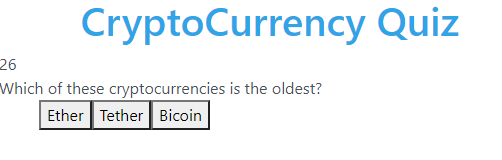

# Crypto Quize, a quiz app

## Description:

Using Javacript, create a quiz for a subject. The quiz includes multiple choice items, functionality which adds/deducts points, and a timer. 

## Testing Instructions:

Click start to start the quiz. Attempt to answer correctly and score a high point.

## Screenshot of App in use:

## Built With:

- Javascript
- HTML
- CSS

## Contribution:

Made with ❤️ by Avrumie Safranovitz
